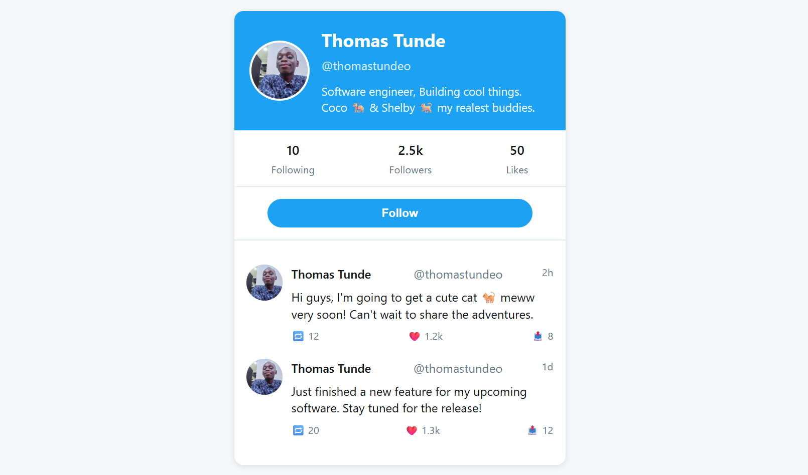

## Thomas Tunde, O X Clone Profile Page




A responsive Twitter/X clone profile page built with HTML, CSS, and JavaScript.


## Description

This is a static profile page that mimics the design and functionality of my Twitter/X  profile. It includes:
- Profile header with avatar and user information
- Stats display (following, followers, likes)
- Tweet cards with interactive like functionality
- Responsive design that works on mobile and desktop devices

## Features

- **Responsive Layout**: Adapts to different screen sizes
- **Interactive Likes**: Click the heart icon to increment like counts
- **Modern Design**: Clean, Twitter-inspired interface
- **Semantic HTML**: Well-structured and accessible markup
- **CSS Variables**: Easy theme customization
- **No Dependencies**: Pure HTML, CSS, and vanilla JavaScript

## How to Use

1. Clone or download this repository
2. Open `xprofile.html` in your web browser
3. Interact with the profile:
   - Click the heart icons on tweets to like them
   - Resize the browser to see the responsive design
   - Follow button demonstrates hover effects

## Implementation Details

### HTML Structure
- Semantic elements for accessibility
- Proper meta tags for responsive design
- Structured tweet components

### CSS Features
- CSS variables for easy color customization
- Flexbox and Grid for layout
- Hover and focus states for interactivity
- Responsive breakpoints for mobile support

### JavaScript Functionality
- Like button interactivity with persistence
- DOM manipulation for dynamic updates
- Event listeners for user interactions

## Customization

### Changing Profile Information
Edit the following sections in `xprofile.html`:
- Profile name (`@thomastundeo`)
- Bio information
- Tweet content and timestamps
- Like counts (modify `data-count` attributes)

### Styling Changes
Modify the CSS variables in the `:root` section:
```css
:root {
  --primary-color: #1da1f2;    /* Twitter blue */
  --background-color: #f5f8fa;
  --card-bg: #ffffff;
  --text-primary: #14171a;
  --text-secondary: #657786;
}
```

## GitHub Integration Plan

See [GitHub Interaction Plan](../../.claude/plans/i-want-to-post-mellow-dusk.md) for details on how to make user interactions contribute to your GitHub contribution heatmap.

## Contributing

If you'd like to improve this profile page:
1. Fork the repository
2. Create a feature branch
3. Commit your changes
4. Open a Pull Request

## License

This project is open source and available under the [MIT License](LICENSE).

## Acknowledgments

- Inspired by Twitter/X profile design
- Built as a learning exercise in frontend development
